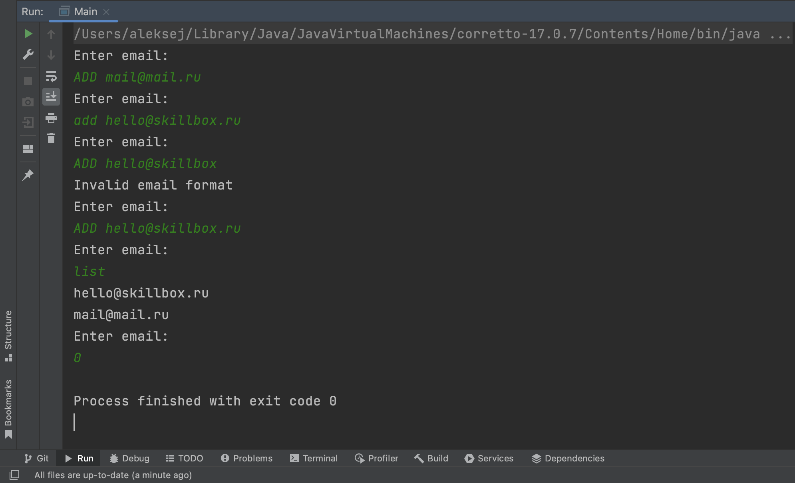

# EmailList

A program that stores a list of email addresses. Addresses can be added via the console with the ADD command and the entire list can be printed with the LIST command.

The program checks the correctness of the entered email and prints an error message if necessary.

